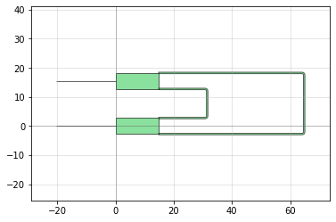
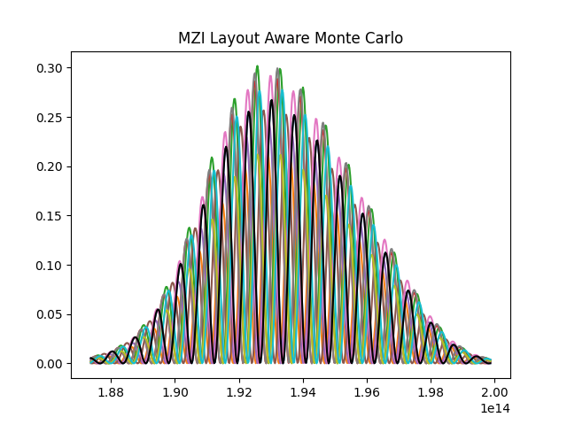

.. _example-layout_aware:

Layout-Aware Monte Carlo Simulations for Yield Estimation
=========================================================

Manufacturing variability can cause fabrication errors in waveguide width and thickness,
which can affect the device performance. Hence, incorporating manufacturing variability 
into the photonic device design process is crucial. Simphony provides the ability to run
layout-aware Monte Carlo simulations for yield estimation to aid in robust photonic device design.
This tutorial will walk you through the codes found in ``examples/layout_aware.py`` and
``examples/layout_aware_from_netlist.py`` of the Simphony repository. We expect you to have read the
previous tutorial, :doc:`mzi`.

The Workflow
------------
A typical workflow for running layout-aware Monte Carlo simulations is as follows:

- instantiate the components of the device
- instantiate a ``Die`` object
- add the components to the ``Die`` object
- distribute the components on the die along a direction of choice
- connect the components to form a circuit
- run the simulation
- extract and plot the results

Example - Mach-Zehnder Interferometer (MZI)
-------------------------------------------
We will run a layout-aware Monte Carlo simulation for the
Mach-Zehnder Interferometer (MZI) described in the previous
example.

First we need to import the necessary Simphony modules. The ``siepic`` model library,
the ``Simulation``, ``Laser``, ``Detector``, and the ``Die`` will be all that we need.
We will also import ``matplotlib.pyplot``, from outside of Simphony, to view the results
of our simulation.

::
  import matplotlib.pyplot as plt

  from simphony.die import Die
  from simphony.libraries import siepic
  from simphony.simulation import Simulation, Laser, Detector

We then create all the components and give them names. These
include the grating couplers, the Y-branches, and the
waveguides (which can be defined at any arbitrary length,
on the condition that the two lengths are different). The components
must be given a name, otherwise they will not be recognized by Simphony.

::
  gc_input = siepic.GratingCoupler(name="gcinput")
  y_splitter = siepic.YBranch(name="ysplit")
  wg_long = siepic.Waveguide(length=150e-6, name="wglong")
  wg_short = siepic.Waveguide(length=50e-6, name="wgshort")
  y_recombiner = siepic.YBranch(name="yrecombiner")
  gc_output = siepic.GratingCoupler(name="gcoutput")

  die = Die(name="die1")

We then add our components to the die, and distribute them across the die.
We have the choice of distributing the components along the x-axis, y-axis,
or along a grid. We can also specify the shape of the grid, and the spacing
between the components.

::
  die.add_components([gc_input, y_splitter, wg_long, gc_output, y_recombiner, wg_short])
  die.distribute_devices(direction='grid', shape=(3,2), spacing=(5,10))

We now connect the components to form a circuit. Simphony will automatically
connect the components and route the waveguides in the die for us, and generate
a layout.

::
  y_splitter["pin1"].connect(gc_input["pin1"])

  y_recombiner["pin1"].connect(gc_output["pin1"])

  y_splitter["pin2"].connect(wg_long)
  y_recombiner["pin3"].connect(wg_long)

  y_splitter["pin3"].connect(wg_short)
  y_recombiner["pin2"].connect(wg_short)

We can visualize the layout before moving on to the next step. This is always good practice,
since we need to verify the layout is correct before running the simulation.

::
  die.visualize()

Simphony then open a new matplotlib window and plots the layout.

We can see the two GratingCouplers on the left as straight lines, and the two
YBranches as green boxes with 3 pins each. The YBranches are connected to each other by
waveguides. None of the waveguides are intersecting with each other or with any of the other
components. We can confirm that our circuit layout is correct and move on to running the simulation.

Layout-Aware Monte Carlo Simulation
-----------------------------------
We use the ``Simulation`` class to run a simulation. We attach a ``Laser`` to one of the GratingCouplers,
and a ``Detector`` to the other GratingCoupler. We then run the simulation.

::
  with Simulation() as sim:
      l = Laser(power=1)
      l.freqsweep(187370000000000.0, 199862000000000.0)
      l.connect(gc_input['pin2'])
      d = Detector()
      d.connect(gc_output['pin2'])

      results = sim.layout_aware_simulation()

Here, we can pass in the standard deviations of the widths and thicknesses, as well as the correlation length
as arguments to the ``layout_aware_simulation`` method. For this example, we use the default values.

After the simulation is run, we can extract the results, and plot them. We will see several, slightly different curves
due to random variations incorporated into the components' widths and thicknesses.

::
  f = l.freqs
  for run in results:
    p = []
    for sample in run:
        for data_list in sample:
            for data in data_list:
                p.append(data)
    plt.plot(f, p)

  run = results[0]
  p = []
  for sample in run:
      for data_list in sample:
          for data in data_list:
              p.append(data)
  plt.plot(f, p, 'k')
  plt.title('MZI Layout Aware Monte Carlo')
  plt.show()

You should see something similar to this graph when you run
your MZI now:

From our data, we can then compute various performance markers which are sensitive
to width and thickness variations.
