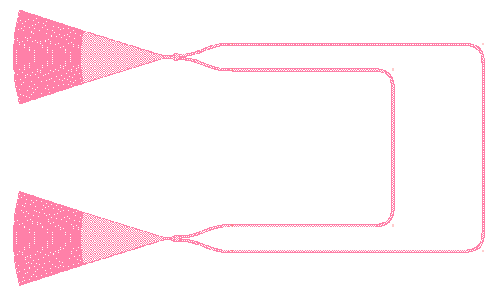

.. _example-mzi:

Mach-Zehnder Interferometer
===========================

In this tutorial, we'll define and simulate a simple circuit
known as a Mach-Zender Interferometer (MZI). This tutorial
will walk through the code found in ``examples/mzi.py`` of
the Simphony repository. We expect you to have read the
previous tutorial, :doc:`intro`.

Deconstructing the MZI
----------------------
In an MZI, light entering the circuit is split and travels 
down two paths of differing lengths. When the light is
recombined, it interferes, and the output is
frequency-dependent.

    A basic MZI. 

The MZI we'll create can be broken down into constituent
parts. Simphony includes models for these constituent parts
below:

The grating couplers are the input and output for light in
the circuit. The Y-branch can split and recombine light, and
because the waveguides which carry light across the circuit
are varying length, this produces interference when the
light is recombined at the second Y-branch. We can now begin
defining our circuit in Simphony using the components we
have identified.

Defining The Circuit
--------------------
First we need to import the necessary Simphony modules. The
``siepic`` model library, the ``SweepSimulator`` and the
``MonteCarloSweepSimulator`` will be all that we need. We
will also import ``matplotlib.pyplot``, from outside of
Simphony, to view the results of our simulation.

.. code-block:: python

    import matplotlib.pyplot as plt

    from simphony.libraries import siepic
    from simphony.simulators import MonteCarloSweepSimulator, SweepSimulator
      
We then create all the components identified earlier. These
include the grating couplers, the Y-branches, and the
waveguides (which can be defined at any arbitrary length,
on the condition that the two lengths are different).

.. code-block:: python

    gc_input = siepic.GratingCoupler()
    y_splitter = siepic.YBranch()
    wg_long = siepic.Waveguide(length=150e-6)
    wg_short = siepic.Waveguide(length=50e-6)
    y_recombiner = siepic.YBranch()
    gc_output = siepic.GratingCoupler()

Once we have our components, we can connect them. We can
reference the diagram above on which connections to make.

.. code-block:: python

    # next we connect the components to each other
    # you can connect pins directly:
    y_splitter["pin1"].connect(gc_input["pin1"])

    # or connect components with components:
    # (when using components to make connections, their first unconnected pin will
    # be used to make the connection.)
    y_splitter.connect(wg_long)

    # or any combination of the two:
    y_splitter["pin3"].connect(wg_short)
    # y_splitter.connect(wg_short["pin1"])

    # when making multiple connections, it is often simpler to use `multiconnect`
    # multiconnect accepts components, pins, and None
    # if None is passed in, the corresponding pin is skipped
    y_recombiner.multiconnect(gc_output, wg_short, wg_long)

.. note::

    There are several different ways of connecting components
    in Simphony, and many are demonstrated in this example,
    with comments included.

    You may also wish to rename pins for better semantics when
    writing your own circuit. This can be done with
    ``component.rename_pins('new_pin1', 'new_pin2', ...)``, on
    any of the components we have created.

    ``rename_pins`` can be called on a model itself. This will
    create default names for any new component you instantiate
    of that model.

These are all the connections required to define our
circuit. The next step will be to run the simulations.

Sweep Simulation
----------------
First, we'll do a standard sweep simulation. We define the 
simulator, the frequency range to run, and then connect it
to the input and output of our circuit:

.. code-block:: python

    simulator = SweepSimulator(1500e-9, 1600e-9)
    simulator.multiconnect(gc_input, gc_output)

Now we simulate. We hand the results over to ``matplotlib``
for a graph visualization (see `matplotlib docs`_ for how it
works).

.. code-block:: python

    f, p = simulator.simulate()
    plt.plot(f, p)
    plt.title("MZI")
    plt.tight_layout()
    plt.show()

When you run your MZI python file, it should bring up a
graph showing something similar to this:

.. image:: images/plot_mzi.png
    :align: center

Monte-Carlo Simulation
----------------------
Let's also run a Monte-Carlo simulation. This type of
simulation estimates manufacturing variability and margin of
error found on real silicon circuits. Disconnect the
previous simulator to connect the new simulator:

.. code-block:: python

    simulator.disconnect()
    simulator = MonteCarloSweepSimulator(1500e-9, 1600e-9)
    simulator.multiconnect(gc_input, gc_output)

Then we run the Monte-Carlo simulation several times,
plotting each curve. We will now see several, slightly
different curves on our graph due to random variation.

.. code-block:: python

    results = simulator.simulate(runs=10)
    for f, p in results:
      plt.plot(f, p)

Finally, we can plot the first simulation again with black,
to make sure it displays on top. We want this because the
first simulation records results for ideal conditions.

.. code-block:: python

    f, p = results[0]
    plt.plot(f, p, "k")
    plt.title("MZI Monte Carlo")
    plt.tight_layout()
    plt.show()

You should see something similar to this graph when you run
your MZI now:

We have now defined and simulated our MZI! This completes
our tutorial.

.. _matplotlib docs: https://matplotlib.org/
