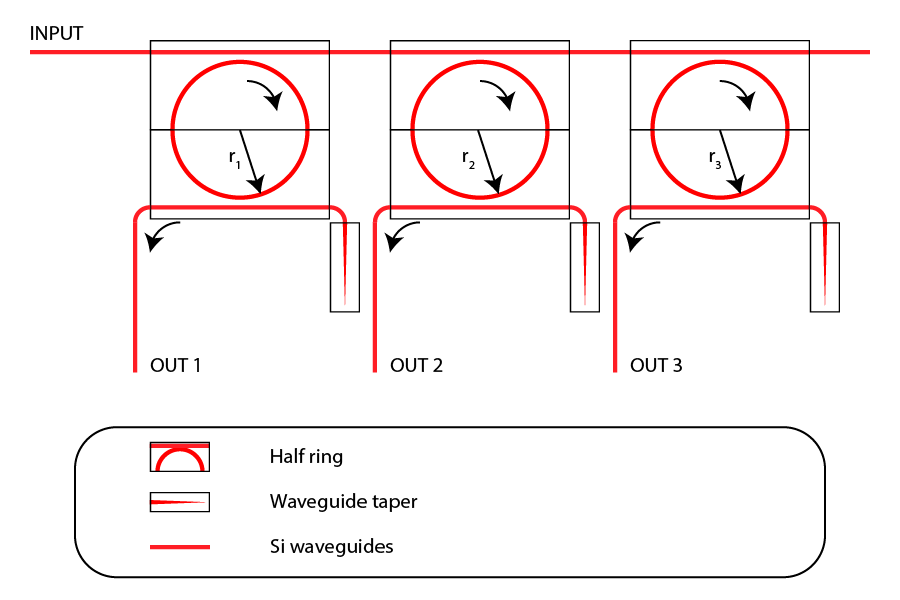
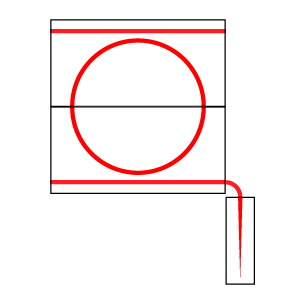
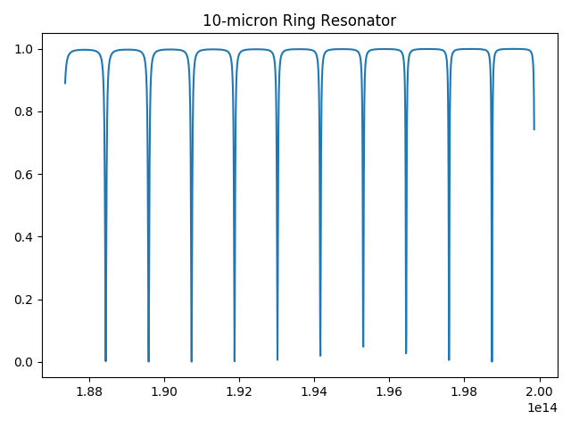
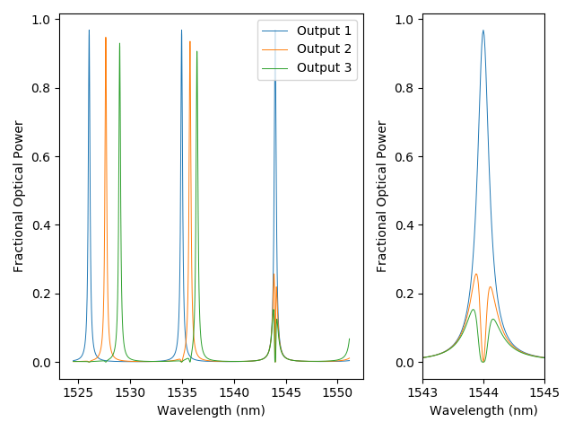

.. _example-filters:

Add-Drop Filters
================

.. note::
   This tutorial requires the installation of SiPANN. See 
   :ref:`Companion Libraries <companion-libraries>` for more details.

In this tutorial, we're going to create a simulation that would predict
the frequency response of a single-input, multiple-output Add-Drop Filter.

   A sample add-drop filter. The values of "r1", "r2", and "r3" are all 
   different from each other.

An add-drop filter uses rings of different radii to "select" out specific 
frequencies from a main data line and convey them to an output.

.. note::
   You should be familiar with the processes explained in the 
   :ref:`MZI Tutorial <example-mzi>` before doing this 
   tutorial, as it provides a more detailed overview of decomposing circuits 
   into blocks, declaring the models required in a circuit, and making 
   connections between elements.

Code Walkthrough
----------------

This example walks through the file "filters.py". 

::

    #!/usr/bin/env python3
    # -*- coding: utf-8 -*-
    #
    # Copyright © Simphony Project Contributors
    # Licensed under the terms of the MIT License
    # (see simphony/__init__.py for details)
    #
    # File: filters.py

For this tutorial, we will be using matplotlib and numpy to manipulate and
view the results of our simulation. 

::

    import matplotlib.pyplot as plt
    import matplotlib.gridspec as gridspec
    import numpy as np

We'll need the following modules and objects from simphony:

* **sipann**:
  The SiPANN model library, which provides models trained using machine learning
  techniques. Since they're not premodeled using a process such as FDTD, we're 
  not limited to specific parameterized devices for which simulations have
  already been performed.

* **simphony.library.siepic**:
  We use waveguide and terminator models from the ``siepic`` library.

* **simphony.netlist.Subcircuit**:
  We use the Subcircuit object to define our photonic circuits.

* **simphony.simulation.SweepSimulation**:
  The ``SweepSimulation`` takes our circuit and calculates the outputs
  for a frequency sweep simulation.

* **simphony.tools.freq2wl**:
  A convenience function provided by Simphony for converting frequencies
  to wavelengths.

::

    from SiPANN import scee
    from SiPANN.scee_int import SimphonyWrapper
    from simphony.library import siepic
    from simphony.netlist import Subcircuit
    from simphony.simulation import SweepSimulation
    from simphony.tools import freq2wl

The tutorial began with a block-diagram model of our final construction.
Note the main input data line and terminators. We can declare the models we'll use
for those circuit instances.

::

    # Have a main data line where frequency multiplexed data enters the circuit.
    wg_data = siepic.ebeam_wg_integral_1550(100e-6)

    # A terminator for dispersing unused light
    term = siepic.ebeam_terminator_te1550()

Our final product has a component that is duplicated three times with varying
parameters. This kind of redundancy makes an excellent case for the use of the
:ref:`factory method design pattern<factory-method-design-pattern>`.

   A block-diagram model of a ring resonator alone. Note the port with a 
   termination; light is never designed to travel in that direction, so any
   potential back-scattered light is simply dispersed.

The following function generates a subcircuit of a ring resonator, as pictured above,
with a radius given as a parameter. The subcircuit it returns can be used within
another circuit, just like any regular, base model.

::

    def ring_factory(radius):
        """
        Creates a full ring (with terminator) from a half ring.

        Ports of a half ring are ordered like so:
        2           4
        |         |
         \       /
          \     /
        ---=====---
        1           3

        Resulting pins are ('in', 'out', 'pass').

        Parameters
        ----------
        radius : float
            The radius of the ring resonator, in nanometers.
        """
        # Have rings for selecting out frequencies from the data line.
        # See SiPANN's model API for argument order and units.
        half_ring = SimphonyWrapper(scee.HalfRing(500, 220, radius, 100))

        circuit = Subcircuit()
        circuit.add([
            (half_ring, 'input'),
            (half_ring, 'output'),
            (term, 'terminator')
        ])

        circuit.elements['input'].pins = ('pass', 'midb', 'in', 'midt')
        circuit.elements['output'].pins = ('out', 'midt', 'term', 'midb')
        
        circuit.connect_many([
            ('input', 'midb', 'output', 'midb'),
            ('input', 'midt', 'output', 'midt'),
            ('terminator', 'n1', 'output', 'term')
        ])

        return circuit

Before we construct the full add-drop filter, we can run a simulation on a 
single ring to make sure our code is behaving the way we'd expect.

::

    # Behold, we can run a simulation on a single ring resonator.
    cir1 = ring_factory(10000)
    sim1 = SweepSimulation(cir1, 1500e-9, 1600e-9)
    res1 = sim1.simulate()

    f1, s = res1.data(res1.pinlist['in'], res1.pinlist['pass'])
    plt.plot(f1, s)
    plt.title("10-micron Ring Resonator")
    plt.tight_layout()
    plt.show()

   The through-port frequency response of a 10 micron ring resonator.

Now we'll add several of these ring resonators to our circuit. They
will be cascaded together to create our filter.

::

    # Now, we'll create the circuit (using several ring resonator subcircuits)
    # and add all individual instances.
    circuit = Subcircuit('Add-Drop Filter')
    e = circuit.add([
        (wg_data, 'input'),
        (ring_factory(10000), 'ring10'),
        (wg_data, 'out1'),

        (wg_data, 'connect1'),
        (ring_factory(11000), 'ring11'),
        (wg_data, 'out2'),

        (wg_data, 'connect2'),
        (ring_factory(12000), 'ring12'),
        (wg_data, 'out3'),

        (term, 'terminator')
    ])

We can rename pins, as convenient, either individually or simulateously.
For ease of accessing outputs post-simulation, we'll rename some of the 
ports. Renaming requires prior knowledge of how ports are laid out on the 
device. For pin ordering on SiPANN models, see their `documentation`_.

.. _documentation: https://sipann.readthedocs.io/

::

    # You can set pin names individually (here I'm naming all the outputs that
    # I'll want to access after the simulation has been run):
    circuit.elements['input'].pins['n1'] = 'input'
    circuit.elements['out1'].pins['n2'] = 'out1'
    circuit.elements['out2'].pins['n2'] = 'out2'
    circuit.elements['out3'].pins['n2'] = 'out3'

Now we'll define all circuit connections:

::

    circuit.connect_many([
        ('input', 'n2', 'ring10', 'in'),
        ('out1', 'n1', 'ring10', 'out'),
        ('connect1', 'n1', 'ring10', 'pass'),

        ('connect1', 'n2', 'ring11', 'in'),
        ('out2', 'n1', 'ring11', 'out'),
        ('connect2', 'n1', 'ring11', 'pass'),

        ('connect2', 'n2', 'ring12', 'in'),
        ('out3', 'n1', 'ring12', 'out'),
        ('terminator', 'n1', 'ring12', 'pass'),
    ])

Finally, let's run a sweep simulation. (Notice the reduced frequency range, 
since I'm interested in focusing in on only a few peaks, instead of a
perhaps standard, full 1500nm-1600nm sweep.)

::

    # Run a simulation on the netlist.
    simulation = SweepSimulation(circuit, 1524.5e-9, 1551.15e-9)
    result = simulation.simulate()

The rest of this confusing "gridspec" code is to create a pretty plot that
looks at the full sweep range and also a single peak that I'm particularly
interested in. The main takeaway from this section is that getting the
data out of a simulation object is as simple as calling 
:py:func:`data <simphony.simulation.SweepSimulationResult.data>` and
providing the names of the pins you're using as an input and output.

::

    fig = plt.figure(tight_layout=True)
    gs = gridspec.GridSpec(1, 3)

    ax = fig.add_subplot(gs[0, :2])
    f, s = result.data('input', 'out1')
    ax.plot(freq2wl(f)*1e9, s, label='Output 1', lw='0.7')
    f, s = result.data('input', 'out2')
    ax.plot(freq2wl(f)*1e9, s, label='Output 2', lw='0.7')
    f, s = result.data('input', 'out3')
    ax.plot(freq2wl(f)*1e9, s, label='Output 3', lw='0.7')

    ax.set_ylabel("Fractional Optical Power")
    ax.set_xlabel("Wavelength (nm)")
    plt.legend(loc='upper right')

    ax = fig.add_subplot(gs[0, 2])
    f, s = result.data('input', 'out1')
    ax.plot(freq2wl(f)*1e9, s, label='Output 1', lw='0.7')
    f, s = result.data('input', 'out2')
    ax.plot(freq2wl(f)*1e9, s, label='Output 2', lw='0.7')
    f, s = result.data('input', 'out3')
    ax.plot(freq2wl(f)*1e9, s, label='Output 3', lw='0.7')

    ax.set_xlim(1543,1545)
    ax.set_ylabel("Fractional Optical Power")
    ax.set_xlabel("Wavelength (nm)")

    fig.align_labels()
    plt.show()

   The response of our designed add-drop filter.

Full Code Listing
-----------------

.. literalinclude:: ../../../../examples/filters.py

.. Example Rendered
.. ================

.. .. ifconfig:: python_version_major < '3'

..     The example is rendered only when sphinx is run with python3 and above

.. .. automodule:: doc.example
..     :members: