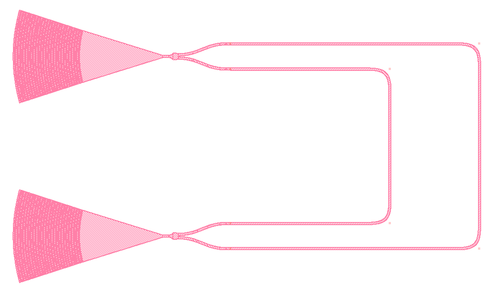
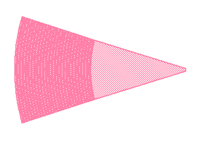
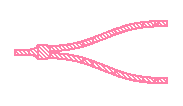
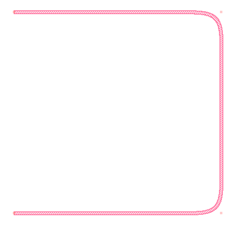
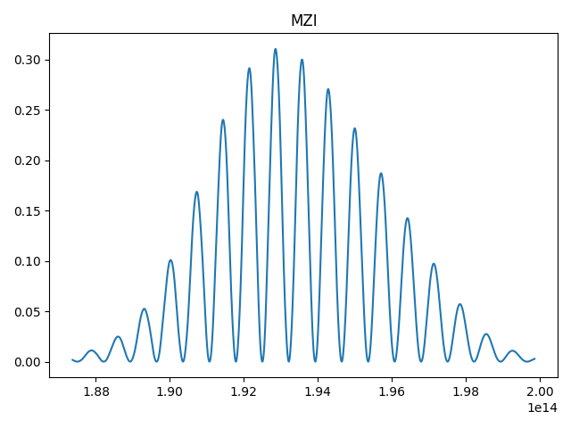
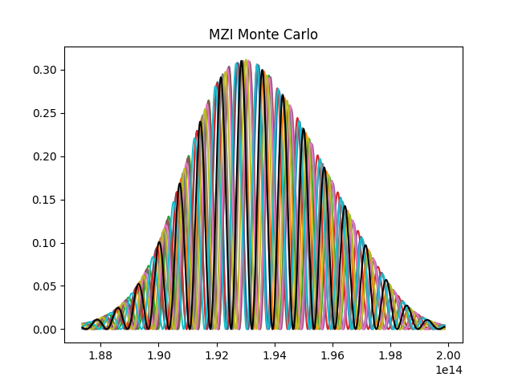

.. _example-mzi:

Mach-Zehnder Interferometer
===========================

In this tutorial, we're going to create a simulation that would predict
the frequency response of a Mach-Zehnder Interferometer (MZI).

   A basic MZI. 
   
In an MZI, light entering one port is split and travels down two paths
of differing lengths. When the light is recombined, it interferes, 
producing a frequency-dependent response.

Code Walkthrough
----------------

::

    #!/usr/bin/env python3
    # -*- coding: utf-8 -*-
    #
    # Copyright © Simphony Project Contributors
    # Licensed under the terms of the MIT License
    # (see simphony/__init__.py for details)
    #
    # File: mzi.py

For this tutorial, we will be using matplotlib and numpy to manipulate and
view the results of our simulation.

::

    import matplotlib.pyplot as plt
    import numpy as np

We'll need the following modules and objects from simphony:

* **simphony.library.siepic**:
  The SiEPIC EBeam PDK model library.

* **simphony.netlist.Subcircuit**:
  We use the Subcircuit object to define our photonic circuits.

* **simphony.simulation.SweepSimulation**:
  The ``SweepSimulation`` takes our circuit and calculates the outputs
  for a frequency sweep simulation.

* **simphony.simulation.MonteCarloSweepSimulation**:
  The ``MonteCarloSweepSimulation`` will perform several sweep simulations,
  each time tweaking device parameters to simulate manufacturing variability.

::
    
    from simphony.library import ebeam
    from simphony.netlist import Subcircuit
    from simphony.simulation import SweepSimulation, MonteCarloSweepSimulation

The MZI we'll create uses only a few simple models. 
You'll note that the basic MZI circuit can be broken down into some very
basic, repeated "blocks".

.. image:: images/mzi_outline_ports_marked.png
   :alt: waveguide
   :align: center

We only need to declare a model for each unique *type* of block.

1. Grating couplers, for inserting and extracting light from the circuit.

2. Y-branches, for splitting and recombining (and interfering) the light.

3. Waveguides to carry the light from the input to the output. They vary in 
   length in order to produce an interference pattern.

The following snippet declares the grating coupler, the y-branch, and two
waveguides; since they have different parameters (length), they're considered
to be unique models.
::

    # Declare the models used in the circuit
    gc = siepic.ebeam_gc_te1550()
    y = siepic.ebeam_y_1550()
    wg150 = siepic.ebeam_wg_integral_1550(length=150e-6)
    wg50 = siepic.ebeam_wg_integral_1550(length=50e-6)

We'll add all the components into a circuit without worrying about the 
connections for now. We also give names to the devices as we add them to make
the circuit human-readable and for ease in making connections later.

::

    # Create the circuit, add all individual instances
    circuit = Subcircuit('MZI')
    e = circuit.add([
        (gc, 'input'),
        (gc, 'output'),
        (y, 'splitter'),
        (y, 'recombiner'),
        (wg150, 'wg_long'),
        (wg50, 'wg_short'),
    ])

Note that :py:func:`add <simphony.netlist.Subcircuit.add>` returns a list of 
object references, references to each element added to the subcircuit, where
insertion order is preserved.

For ease of making connections, we'll rename some of the ports. Renaming 
requires prior knowledge of how ports are laid out on the device. For
the SiEPIC library, you can reference the 
:ref:`model library documentation <siepic-documentation>`.

The syntax for renaming pins allows them to be renamed individually:

::

    circuit.elements['input'].pins['n2'] = 'input'
    circuit.elements['output'].pins['n2'] = 'output'

or simultaneously, the order being the same as the order of the original pin
names (reference the model library's documentation):

::

    circuit.elements['splitter'].pins = ('in1', 'out1', 'out2')
    circuit.elements['recombiner'].pins = ('out1', 'in2', 'in1')

.. note::
   Pins can be renamed for an individual :py:class:`Element <simphony.netlist.Element>` 
   or for a :py:class:`Model <simphony.elements.Model>`. When renamed
   for an Element, only that Element is affected; if renamed for a Model, all 
   future created Elements that reference that Model will assume the new pin 
   names. See the :ref:`Introduction <introduction-to-simphony>` to learn about the difference between
   Elements and Models.

Next we define the circuit's connections, again referencing the pin names
(using the default names, unless you've renamed the pins). You can use either
:py:func:`connect <simphony.netlist.Subcircuit.connect>`, which accepts four parameters: ::

    (first element name, first element port, connecting element name, connecting element port)

or :py:func:`connect_many <simphony.netlist.Subcircuit.connect_many>`, which takes a list of
tuples, each tuple having the same four-argument format.

::

    # Circuits can be connected using the elements' string names:
    circuit.connect_many([
        ('input', 'n1', 'splitter', 'in1'),
        ('splitter', 'out1', 'wg_long', 'n1'),
        ('splitter', 'out2', 'wg_short', 'n1'),
        ('recombiner', 'in1', 'wg_long', 'n2'),
        ('recombiner', 'in2', 'wg_short', 'n2'),
        ('output', 'n1', 'recombiner', 'out1'),
    ])

Note that connections can be made using array indexing as well. If you know
what order your components were inserted into the circuit (insertion order is 
preserved) or what index the pin you want to connect to is at, you can use 
those details to form your connections. ::

    # or by using the actual object reference.
    # circuit.connect(e[0], e[0].pin[0], e[2], e[2].pin[0])

At this point, your circuit is defined. This file can serve as a description
for a subcircuit that is used in a larger circuit, and can simply be imported
using the Python import system (e.g., ``from mzi import circuit``).

Running a simulation on our fully-defined circuit is really easy.

::

    simulation = SweepSimulation(circuit, 1500e-9, 1600e-9)
    result = simulation.simulate()

Finally, we can plot the simulation result data. We can access the pins 
using their string names.

::

    f, s = result.data('input', 'output')
    plt.plot(f, s)
    plt.title("MZI")
    plt.tight_layout()
    plt.show()

We can even run a monte carlo simulation, which simulates manufacturing 
variability. The data stored at the 0th index, and plotted on top in black, 
is the ideal values.

::

    # We can run a monte carlo simulation on the circuit, too
    simulation = MonteCarloSweepSimulation(circuit, 1500e-9, 1600e-9)
    runs = 10
    result = simulation.simulate(runs=runs)
    for i in range(1, runs + 1):
        f, s = result.data('input', 'output', i, dB=True)
        plt.plot(f, s)
    
    # The data located at the 0 position is the ideal values.
    f, s = result.data('input', 'output', 0, dB=True)
    plt.plot(f, s, 'k')
    plt.title("MZI Monte Carlo")
    plt.tight_layout()
    plt.show()

Full Code Listing
-----------------

.. literalinclude:: ../../../../examples/mzi.py
